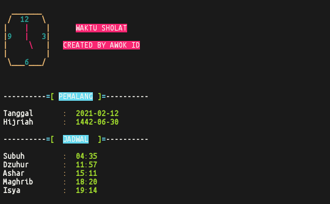

### JadSho
 Sebuah program sederhana yang diciptakan untuk membantu orang-orang dalam melihat waktu sholat didaerah masing-masing

### Screenshots

### Installing

- apt update && apt upgrade
- apt install python
- apt install git
- pip install requests
- git clone https://github.com/DavitID/JadSho
- cd JadSho
- python JadSho.py
